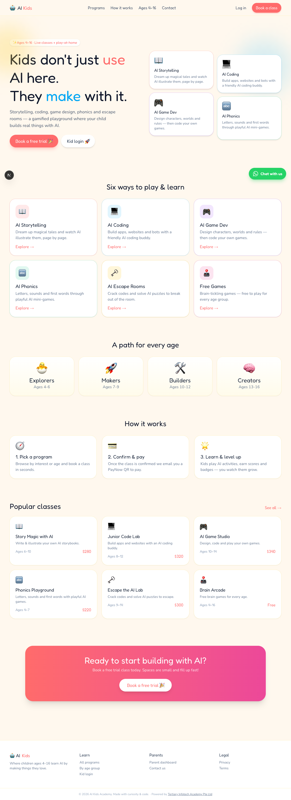

<div align="center">

# 🤖 AI Kids Academy

[](https://nextjs.org/)
[](https://react.dev/)
[](https://www.typescriptlang.org/)
[](https://tailwindcss.com/)
[](https://orm.drizzle.team/)
[](https://www.postgresql.org/)
[](https://authjs.dev/)
[](https://docs.anthropic.com/)

**Where kids ages 4–16 don't just *use* AI — they *make* with it.** 🎨💻🎮

AI storytelling · coding · game design · phonics · escape rooms — a gamified learning playground plus live class booking for parents.

[Report Bug](https://github.com/alfredang/ai4kids/issues) · [Request Feature](https://github.com/alfredang/ai4kids/issues)

</div>

## Screenshot



## About

**AI Kids Academy** is a kids' AI education portal that combines a **gamified learning playground** with a **class-booking platform** for parents. Children log in to their own colourful dashboard to play AI-powered activities and earn points and badges; parents browse programs, book classes online, and track their kids' progress; admins manage the whole catalogue from a back-office.

### Key Features

| Area | What it does |
|------|--------------|
| 🎭 **Three roles** | **Learners** (kids) log in with a username + password; **Parents** & **Admins** sign in with Google (or credentials). Each role lands on its own dashboard. |
| 🧩 **AI activities** | **AI Storytelling** (writes & illustrates a story) and **AI Phonics** (listen-and-match word game) are fully playable; AI Coding, Game Dev, Escape Rooms & Free Games are scaffolded. |
| 🏆 **Gamification** | Every activity awards a score; kids collect badges and climb an opt-in **leaderboard**. |
| 👨‍👩‍👧 **Parent dashboard** | Link multiple kids, see activities completed, total scores, badges, and recent activity per child. |
| 📅 **Online booking** | Parents book a class seat for a child in seconds. |
| 💳 **PayNow payments** | On confirmation, the system generates a dynamic **Singapore PayNow QR** (EMVCo SGQR) and emails it to the parent. |
| 🤖 **Agentic auto-close** | When a class hits its max students it **auto-closes** and an AI routine drafts the "class full" notifications for parents + admin. |
| 🛠️ **Admin back-office** | Manage programs, classes (open/close/edit/delete), bookings (confirm / mark-paid / cancel), and kid↔parent links. |
| 💬 **WhatsApp** | Floating click-to-chat button for instant parent enquiries. |

## Tech Stack

| Category | Technologies |
|----------|--------------|
| **Framework** | Next.js 16 (App Router, Server Actions), React 19 |
| **Language** | TypeScript 5 |
| **Styling** | Tailwind CSS 4 (bright kids theme + dark admin theme), Framer Motion, Fredoka / Nunito fonts |
| **Database** | PostgreSQL 16 + Drizzle ORM |
| **Auth** | Auth.js v5 (Credentials + Google OAuth), JWT sessions, role-based access |
| **AI/LLM** | Anthropic Claude Agent SDK (stories, phonics word-sets, agentic class-close) |
| **Payments** | PayNow QR generation (EMVCo SGQR via `qrcode`) |
| **Email** | Gmail OAuth (transactional booking emails) |
| **Security** | bcrypt password hashing, AES-256-GCM encrypted credential store |

## Architecture

```
┌──────────────────────────────────────────────────────────────────┐
│                         Browser (clients)                          │
│   Public site  ·  Kid playground  ·  Parent dash  ·  Admin CMS     │
└───────────────┬───────────────────────────────┬──────────────────┘
                │  Next.js App Router (RSC + Server Actions)         │
┌───────────────▼───────────────────────────────▼──────────────────┐
│  Auth.js v5 (role guard: learner / parent / admin)                 │
│  ┌──────────────┬───────────────┬───────────────┬──────────────┐  │
│  │  Booking +   │  AI activities │  Gamification │  Admin CRUD   │ │
│  │  PayNow QR   │  (Claude SDK)  │  scores/badge │  programs/... │ │
│  │  + agentic   │                │  leaderboard  │               │ │
│  │  auto-close  │                │               │               │ │
│  └──────┬───────┴───────┬───────┴───────┬───────┴──────┬───────┘  │
└─────────┼───────────────┼───────────────┼──────────────┼──────────┘
          │               │               │              │
   ┌──────▼──────┐  ┌─────▼──────┐  ┌─────▼──────┐ ┌─────▼───────┐
   │ PostgreSQL  │  │ Claude     │  │  Gmail     │ │  PayNow QR   │
   │ (Drizzle)   │  │ Agent SDK  │  │  OAuth     │ │  (SGQR)      │
   └─────────────┘  └────────────┘  └────────────┘ └─────────────┘
```

## Project Structure

```
ai-kids/
├── src/
│   ├── app/
│   │   ├── page.tsx                 # Bright public homepage
│   │   ├── login/                   # Kid + Parent/Admin login tabs
│   │   ├── dashboard/               # Role dispatcher
│   │   ├── programs/                # Catalog + program detail
│   │   ├── book/[classId]/          # Booking flow
│   │   ├── parent/                  # Parent dashboard (kids, bookings, add child)
│   │   ├── learn/                   # Kid playground (activities, leaderboard)
│   │   │   ├── storytelling/        #   live AI activity
│   │   │   └── phonics/             #   live AI activity
│   │   ├── admin/                   # Back-office (programs/classes/bookings/people)
│   │   └── api/learn/               # Activity APIs (storytelling, phonics, score)
│   ├── components/
│   │   ├── public/                  # SiteHeader, SiteFooter
│   │   ├── portal/                  # SignOutButton, shared portal UI
│   │   └── ui/                      # WhatsAppButton, ...
│   ├── db/schema.ts                 # Drizzle schema (programs, classes, bookings, …)
│   └── lib/
│       ├── auth.ts / portal-session.ts   # Auth + role guards
│       ├── paynow.ts                # EMVCo SGQR QR generator
│       ├── booking.ts               # Confirm → PayNow email → agentic auto-close
│       ├── ai.ts                    # Claude Agent SDK wrapper (with fallbacks)
│       ├── activities.ts            # Completions + badge awards
│       └── portal-queries.ts        # Dashboard + leaderboard queries
├── scripts/seed-portal.ts           # Seeds admin, demo parent + kids, programs…
├── drizzle/                         # SQL migrations
└── .env.example
```

## Getting Started

### Prerequisites

- Node.js 22+
- PostgreSQL 16 (local or hosted, e.g. Neon/Supabase)

### Installation

```bash
# 1. Clone
git clone https://github.com/alfredang/ai4kids.git
cd ai4kids

# 2. Install (claude-agent-sdk needs legacy peer resolution)
npm install --legacy-peer-deps

# 3. Configure environment
cp .env.example .env
#   set DATABASE_URL, AUTH_SECRET (openssl rand -base64 32),
#   GOOGLE_CLIENT_ID/SECRET, ADMIN_EMAIL/PASSWORD, PAYNOW_UEN, WHATSAPP_NUMBER

# 4. Create the schema
createdb ai_kids
npm run db:push           # or: psql ai_kids -f drizzle/0000_init_ai_kids.sql

# 5. Seed demo data (admin, parent, kids, programs, classes, activities)
npm run seed:portal

# 6. Run
npm run dev               # http://localhost:3080
```

### Demo logins (from the seed)

| Role | Login |
|------|-------|
| Admin | `admin@…` / your `ADMIN_PASSWORD` — at `/admin/login` |
| Parent | `parent.demo@aikids.local` / `parent123` |
| Kids | `maya-star` / `play123` · `ethan-rocket` / `play123` |

### Enabling the AI + email integrations

The app works fully offline with graceful fallbacks. To go live, add credentials in **Admin → Settings → Credentials** (encrypted store):

- **`anthropic_auth_token`** (an `sk-ant-oat-…` subscription token) — powers AI stories, phonics word-sets and the agentic class-close. Without it, deterministic fallback content is used.
- **Gmail OAuth** (`gmail_user`, `gmail_client_id`, `gmail_client_secret`, `gmail_refresh_token`) — sends the PayNow booking emails. Without it, the QR still renders in the parent dashboard.

## Deployment

Built `output: "standalone"` — deploy as a Docker container (Coolify / Railway / Fly.io) or to **Vercel + Neon/Supabase Postgres**.

```bash
docker build -t ai-kids .
docker run -p 3080:3080 --env-file .env ai-kids
```

Set `DATABASE_URL`, `AUTH_SECRET`, `AUTH_URL`, `NEXT_PUBLIC_SITE_URL`, and Google OAuth env vars in your hosting platform.

## Contributing

1. Fork the repo
2. Create a feature branch: `git checkout -b feature/amazing`
3. Commit your changes: `git commit -m "feat: add amazing"`
4. Push and open a Pull Request

## Developed By

**[Tertiary Infotech Academy Pte. Ltd.](https://www.tertiarycourses.com.sg/)**

## Acknowledgements

- Backend foundation derived from the in-house **ai-cms** platform
- Built with [Next.js](https://nextjs.org/), [Drizzle ORM](https://orm.drizzle.team/), [Auth.js](https://authjs.dev/) and the [Anthropic Claude Agent SDK](https://docs.anthropic.com/)

---

<div align="center">

⭐ If this project sparked some curiosity, give it a star!

</div>
