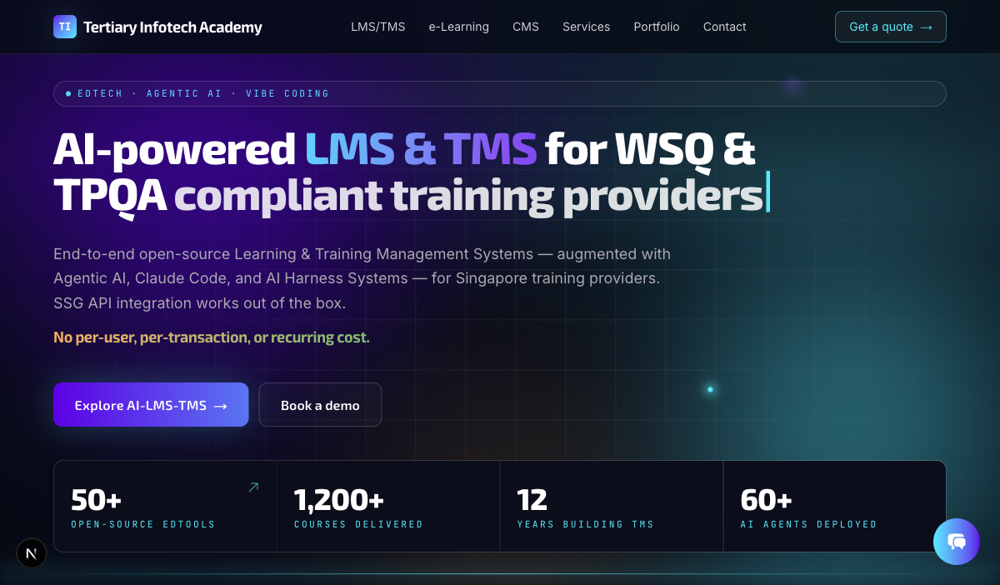

<div align="center">

# AI-Powered CMS

[](https://nextjs.org/)
[](https://react.dev/)
[](https://typescriptlang.org/)
[](https://postgresql.org/)
[](https://orm.drizzle.team/)
[](https://tailwindcss.com/)
[](https://authjs.dev/)
[](https://www.anthropic.com/)
[](https://www.docker.com/)
[](#license)
[](https://www.tertiaryinfotech.com/)

**Customizable frontend and backend, AI-driven content generation, a self-running weekly auto-blog scheduler, a self-improving Nemo lead-gen chatbot, and SEO + lead-generation built into every page — powered by Claude Code. No vendor lock-in.**

🌐 **Live demo:** [https://www.tertiaryinfotech.com/](https://www.tertiaryinfotech.com/)

</div>

## Screenshot



## About

AI-Powered CMS is a production-grade marketing platform built on Next.js 16, engineered for **organic traffic and lead capture**. Every public route ships with full SEO metadata (canonical, OG, Twitter) and JSON-LD structured data (`Organization`, `Article`, `LocalBusiness`, `Service`, `FAQPage`, `HowTo`, `BreadcrumbList`). Every page is a lead funnel: dedicated service landing pages with visual timelines, sticky lead forms, an AI chatbot that converts, and a Gmail-OAuth lead-notification pipeline that delivers submissions to your sales inbox within seconds.

Frontend and backend are fully **customizable** from the admin — hero copy, KPI cards, section headings, service-page content, FAQs, menu, social links, brand identity — all editable without redeploys. AI-driven content generation is built in: admin **AI Assist** drafts, rewrites, summarizes and proposes SEO metadata; the public **AI chatbot** answers visitor questions with your FAQ as authoritative context. All AI is powered by your **Claude subscription OAuth token** through the official Claude Agent SDK — **no metered API billing, no vendor lock-in**.

Originally built to replace a legacy WordPress site for Tertiary Infotech Pte Ltd, the codebase is structured to be re-used as a starting point for any marketing site that needs a real CMS, SEO, lead-gen, and AI authoring.

## Key Features

### SEO built into every route
- Per-route `generateMetadata` — title, description, canonical URL, OG (with image + locale + type), Twitter card
- Sitewide **Organization** JSON-LD with social `sameAs[]`, taxID, postal address
- **Article** + **BreadcrumbList** schema on every blog post (author, datePublished, dateModified, image, mainEntityOfPage)
- **LocalBusiness** schema on `/contact` with opening hours
- **Service** + **HowTo** + **FAQPage** + **BreadcrumbList** schema on every service landing page
- Dynamic `sitemap.xml` + `robots.txt`, regenerated on every content edit via `revalidatePath`
- British / Singapore English spelling baked into the SEO skill

### Lead generation in every page
- **Dedicated service landing pages** with visual 5-step timeline, sticky lead form, FAQ accordion, benefits grid
- **Persistent CTAs** — sticky Get-a-Quote button (desktop), tap-to-call + WhatsApp icons (mobile), AI chatbot above the fold
- **Source-tagged forms** — every form POSTs to `/api/contact` with a `source` label so leads are attributable per page
- **Gmail OAuth2 notification pipeline** — every submission lands in `/admin/leads` *and* emails sales in under 1 second
- **Lead-magnet skill** — built-in conventions for ICP targeting, form-field rules, page anatomy
- **Lead score 1-10** — every inbound submission is scored by message length, keenness keywords (urgent / quote / demo / RFP / budget / …), phone + company completeness, and red-flag penalties (all-caps, repeated chars, `test test`, etc.). Score is computed at intake and backfilled for legacy leads — see [src/lib/lead-score.ts](src/lib/lead-score.ts)
- **Blocklist / Allowlist** — admin-managed glob patterns (`*@163.com`, `spam*@*`, exact emails) decide whether a submission persists. Allow rules always override block rules so known real clients (e.g. `*@haileck.com`) cannot be auto-spammed. Blocked submissions return `200 ok` silently — see [/admin/leads/blocklist](src/app/admin/leads/blocklist/page.tsx)

### CMS — customizable frontend and backend
- **Visual editor everywhere** — hero copy, KPI cards, section headings, service-page content, menus, brand identity, social links, FAQ, contact info — all DB-driven, all editable from `/admin/settings`
- **TipTap rich editor** with image upload, slash commands, draft / published / archived states
- **Pages + Posts + Categories + Tags + Menus + Media + Leads + Blocklist + Redirects + Settings** — full CRUD in `/admin`
- **Featured posts** — admin toggles a star on the posts table to surface a post in the homepage Featured strip; the homepage shows three Featured + three Latest articles, automatically de-duplicated
- **Pages admin** — search (title/slug), status filter, sort (newest / oldest / A→Z), multi-select with bulk delete + bulk status change, pagination at 25/page; each row has per-row View + Edit
- **Tags admin** — compact table view with post-count column, search box, sort (popular / name / slug), pagination at 50/page
- **Dashboard cards** — clickable KPI tiles plus dedicated panels for 10 Most Popular Tags, 5 Latest Posts, and 5 Latest Leads
- **Encrypted credentials vault** — AES-256-GCM at rest, eye-reveal for admins, one-click env → DB migration
- **WordPress migration** — `scripts/migrate-wp.ts` imports a `wp_*` SQL dump, downloads images, preserves Yoast/RankMath SEO, writes 301 redirects
- **Portfolio / Bespoke-Apps pages** — split page-vs-blog categories, a dedicated Portfolio category, lead-gen project pages auto-populated from `alfredang/<repo>` GitHub repos, each carrying a live GitHub repo badge and a lead form
- **Local ⇄ Remote DB sync** — push menus, settings, pages, posts, taxonomy from local to production via a bearer-token API (preserving `createdAt`); pull leads from production back to local (`scripts/pull-leads.ts`); idempotent prod-side schema migration runner at `POST /api/admin/sync/migrate`

### AI built in — Nemo self-improving lead-gen chatbot + Admin AI Assist
- **Nemo AI chatbot** on every public page — branded floating widget that answers visitor questions about your services and routes warm leads to your contact form
- **Self-improving loop** ([src/lib/nemo-reflect.ts](src/lib/nemo-reflect.ts)) — after every captured lead, Nemo replays the transcript through the Claude Agent SDK, extracts ONE concrete tactical lesson (or skips if already optimal), and appends it to the `chat:nemo_lessons` DB row. The next visitor's system prompt includes the growing lessons list, so each new conversation is coached toward a higher lead score. Capped at 25 lessons, deduped, fire-and-forget so the chat response stays snappy.
- **Mission file at the repo root** ([NEMO.md](NEMO.md)) — mission, five qualification signals (interest / use-case / budget / timeline / implementation), and curated seed lessons. Loaded into the system prompt verbatim every turn.
- **Knowledge base + live CMS awareness** — a curated [src/lib/chatbot-knowledge.md](src/lib/chatbot-knowledge.md) covers the AI + SSG service lines with indicative pricing, and `getCmsKnowledgeSnippet()` injects up to 40 published pages + 20 most recent blog posts (5-min TTL) so Nemo can cite and link to live on-site content
- **Nemo doubles as a lead magnet** — an in-chat qualifying-details step (need / timeline / budget) runs *before* asking for Name → Email → Phone, producing a richer, higher-scoring lead; `source=nemo` submissions are labelled **"Nemo Chatbot"** in lead emails and the admin inbox
- **Lead score 1-10 with qualification factors** ([src/lib/lead-score.ts](src/lib/lead-score.ts)) — base + length + keenness keywords + contact-detail bonuses, plus five regex-based qualification factors (specific service named, use-case clarity, budget intent, timeline urgency, implementation interest) capped at +3. Every signal Nemo elicits compounds the score the reflection loop is optimising for.
- **Instant product-catalog answers** — common service/pricing questions are answered from a deterministic catalog before the LLM spawns, and SDK auth errors are suppressed so the widget never shows a stack trace
- **Lightweight harness system** ([src/lib/chatbot-harness.ts](src/lib/chatbot-harness.ts)) — sub-millisecond fast paths before the LLM ever spawns:
  - **Greeting matcher** — `hi`, `hello`, `good morning` etc. → instant canned reply, zero LLM cost
  - **FAQ matcher** — substring + 60% token-overlap match against admin-configured FAQ → instant DB lookup
  - **Agent SDK fallback** — anything not matched falls through to Claude with `maxTurns: 1` and tools disabled
- **System prompt + FAQ editable in `/admin/settings/chatbot`** with `{COMPANY_NAME}`, `{COMPANY_EMAIL}`, `{COMPANY_UEN}` placeholders auto-resolved at chat time
- **Hidden on `/admin/*` routes** — Nemo is a customer-facing widget; it never appears in the back office
- **Admin AI Assist** — `Draft post`, `Rewrite`, `Summarize`, `Suggest SEO meta` powered by the same Claude Agent SDK
- **Subscription-only — no metered API**: the only LLM path in the codebase is `@anthropic-ai/claude-agent-sdk` authenticated with a `sk-ant-oat-*` OAuth subscription token. No `sk-ant-api-*` keys, no `https://api.anthropic.com` calls — see [CLAUDE.md](CLAUDE.md) for the policy
- **Production-safe SDK bundling** — `next.config.ts` force-includes `node_modules/@anthropic-ai/**` via `outputFileTracingIncludes` so the native CLI binary (linux-x64 / arm64) ships in the standalone Docker image

### Automation — self-running scheduled agents
- **Weekly SEO + lead-gen auto-blog** — a boot-time scheduler watches a configured YouTube channel/playlist, picks the latest video, and drafts a fully SEO-wired, internally-linked blog post on a weekly cadence — no human in the loop. Every generated post is engineered for **organic search and lead capture**:
  - SEO title + meta description + keyword set picked by the agent
  - Per-post `Article` + `BreadcrumbList` JSON-LD, OG image, canonical URL, British/Singapore spelling
  - Deep internal links to service pages (LMS / TMS / ATO / TPQA / AI Solutions) so the post funnels traffic into lead-capture surfaces
  - In-body and bottom-of-post **lead-magnet CTAs** routing to `/contact` with `source` tagged for attribution
  - Branded R2-hosted cover image auto-generated from the post title
- **Hourly local → prod DB sync** — content edited locally is pushed to production every hour over the bearer-token sync API, so the live site self-heals from the source-of-truth DB
- **Resilient by design** — `blog_schedule_runs` is created on boot and every run is recorded; the schedule page loads tolerantly even before the first run exists, and a failed run never blocks the next one
- **`POST /api/admin/sync/posts` debug probe** — a GET variant inspects what would sync without mutating prod

### Platform — auth, security, design
- **Auth.js v5** — credentials provider with bcrypt, JWT sessions, persistent 10-year sliding cookie, middleware-protected `/admin/*`
- **Never-logout admin** — cookie-presence guard everywhere; no code path in the admin chrome calls `auth()` and risks emitting a clearing `Set-Cookie`
- **Sci-fi / robotics design system** — dark theme, Exo 2 + Inter, cyan/purple/amber accents, animated glow gradients, custom Tailwind 4 design tokens

## Tech Stack

| Layer | Technology |
|----------|-----------|
| **Framework** | Next.js 16 (App Router, Server Components, Server Actions, Turbopack) |
| **Runtime** | Node.js 22 (Alpine) · React 19 |
| **Language** | TypeScript 5 (strict) |
| **Database** | PostgreSQL 16 via Drizzle ORM 0.36 + drizzle-kit 0.30 |
| **Auth** | Auth.js v5 (credentials provider + bcrypt, JWT sessions) |
| **AI (public chatbot)** | Anthropic **Claude Agent SDK** — `CLAUDE_CODE_OAUTH_TOKEN` |
| **AI (admin assist)** | Anthropic **Claude Agent SDK** — same OAuth token, no per-call billing |
| **Editor** | TipTap 2 with image upload + slash commands |
| **Email** | Nodemailer + Gmail OAuth2 (via `googleapis`) |
| **Encryption** | AES-256-GCM (Node `crypto`) for credentials at rest |
| **UI** | Tailwind CSS 4 (dark + neon theme) · Framer Motion 12 · react-icons · custom design tokens |
| **Validation** | Zod 3 |
| **Deploy** | Coolify · multi-stage `Dockerfile` (Node 22 Alpine) · Next.js `standalone` output |

## Architecture

```
┌────────────────────────────────────────────────────────────────────┐
│                       Public site (Next.js)                        │
│   Hero · LMS/TMS showcase · e-Learning · Services · Blog · Leads   │
│   AI chatbot widget (Claude Agent SDK · OAuth subscription)      │
└────────────────────────────┬───────────────────────────────────────┘
                             │
┌────────────────────────────▼───────────────────────────────────────┐
│                      Admin (Next.js /admin)                        │
│   TipTap editor · AI Assist · Media · Menus · Settings             │
│   Encrypted credentials vault (AES-256-GCM)                        │
└────────────────────────────┬───────────────────────────────────────┘
                             │
┌────────────────────────────▼───────────────────────────────────────┐
│                          Data Layer                                │
│   PostgreSQL (Drizzle ORM) · local /public/uploads · Gmail OAuth2  │
│   Encrypted secrets in `settings` table                            │
└────────────────────────────────────────────────────────────────────┘
```

## Quick Start

### Prerequisites

- **Node.js** 22+ (matches the production `Dockerfile`)
- **PostgreSQL** 15+
- **Claude subscription** — generate an OAuth token locally with `claude setup-token`

### Installation

```bash
git clone https://github.com/alfredang/ai-cms.git
cd ai-cms

cp .env.example .env
# Fill DATABASE_URL, AUTH_SECRET, ADMIN_EMAIL, ADMIN_PASSWORD,
# GMAIL_* (optional), ANTHROPIC_AUTH_TOKEN (optional — can also set in admin UI)

npm install
npm run db:push       # create tables from src/db/schema.ts
npm run seed:admin    # creates admin user + default header/footer menus
npm run dev
```

Visit:
- `http://localhost:3000` — public site
- `http://localhost:3000/admin` — admin (redirects to `/admin/login`)

### Optional: Import from WordPress

```bash
npm run migrate:wp    # parses a wp_*.sql dump, imports posts/pages,
                      # downloads images, writes 301 redirects
```

## Configuring AI Chatbot (public chatbot)

1. Generate a Claude OAuth subscription token: `claude setup-token`
2. In the admin, go to **Settings → Credentials** and paste the `sk-ant-oat-…` token
3. Open **Settings → Chatbot** and edit the **system prompt** and **FAQ** entries
4. The widget on the public site uses `query()` from `@anthropic-ai/claude-agent-sdk`, authenticated via `CLAUDE_CODE_OAUTH_TOKEN`

> The AI chatbot uses the bundled native Claude binary shipped with the Agent SDK, so no separate `claude` CLI install is required.

## Folder Layout

```
src/
  app/
    page.tsx                  Landing (Hero, LMS/TMS, e-Learning, Services, FeaturedPosts, ContactForm)
    blog/[slug]/page.tsx      Single post
    [slug]/page.tsx           Dynamic CMS page (with redirects lookup)
    admin/
      posts/                  Filterable + paginated post list, TipTap editor
      pages/                  Same for pages
      categories/             Category CRUD
      tags/                   Tag CRUD
      menus/                  Header + footer menu builder
      media/                  Media library
      leads/                  Lead inbox
      settings/
        page.tsx              General (site title, tagline, contact email)
        company/              Brand identity (short name, full name, logo)
        chatbot/              AI Chatbot system prompt + FAQ editor
        credentials/          Encrypted credentials vault
    api/
      auth/[...nextauth]/     NextAuth handlers
      contact/                Lead form + Gmail OAuth2 email
      chat/                   AI Chatbot — Claude Agent SDK
      ai/assist/              Admin AI Assist — Claude Agent SDK
      credentials/            Encrypted credentials CRUD
      upload/                 Media upload
    sitemap.ts                Generated from DB
    robots.ts
  components/
    layout/                   Navbar, Footer (DB-driven menus), Container
    sections/                 Hero · AILmsTmsShowcase · ELearningShowcase · EdToolsShowcase · Services · WhyChooseUs · FeaturedPosts · ContactForm
    admin/                    Editor, PostEditorForm, AIAssistButton, MediaUploader, CredentialsForm
    ui/                       ChatBot (AI Chatbot)
  db/                         Drizzle schema + connection
  lib/
    auth.ts                   Auth.js v5 setup
    anthropic-auth.ts         buildClaudeEnv() for the Agent SDK subprocess
    chatbot-settings.ts       AI Chatbot system prompt + FAQ read/write
    secrets.ts                AES-256-GCM credentials vault
    site-content.ts           Static feature copy
    site-settings.ts          Brand identity loader
    ai/claude.ts              Admin AI Assist runner
scripts/
  seed-admin.ts               Admin user + default menus + settings
  seed-categories.ts          Default category taxonomy
  migrate-wp.ts               WordPress → Postgres importer
  reset-header-menu.ts        Rewrite header menu items
```

## Scripts

| Command | Purpose |
|---------|---------|
| `npm run dev` | Dev server (Turbopack) |
| `npm run build` | Production build |
| `npm run start` | Production server |
| `npm run db:push` | Apply schema to DB (dev only) |
| `npm run db:migrate` | Run migrations (production) |
| `npm run seed:admin` | Seed admin user + default menus |
| `npm run migrate:wp` | Import a WordPress SQL dump |

## Deployment

### Coolify (default)

The repo ships with a production-ready multi-stage `Dockerfile` (Node 22 Alpine, Next.js `standalone` output). Coolify builds straight from it — no nixpacks, no Buildpacks.

1. Provision a Postgres service in Coolify and note the `DATABASE_URL`.
2. Create an application from this repo — Coolify picks up the `Dockerfile` automatically.
3. Set the environment variables (see `.env.example`).
4. First deploy: SSH in and run `npm run db:push && npm run seed:admin`.
5. Add the custom domain once a staging URL is verified.

### Other platforms

Standard Next.js `standalone` build — the same `Dockerfile` runs on any container host (Fly.io, Railway, Render, ECS, Kubernetes). For Vercel, deploy directly without the Dockerfile.

## Security Notes

- **Credentials at rest**: every value stored in the credentials vault is encrypted with AES-256-GCM, keyed off `AUTH_SECRET` (SHA-256). Plaintext is never returned to the browser once saved.
- **Admin auth**: `/admin/*` is protected by Auth.js middleware; non-`/admin/login` requests without a session redirect to login.
- **AI Chatbot**: the chatbot never sees the OAuth token client-side — the token is read server-side and injected into the Agent SDK subprocess env.

## License

Proprietary / All Rights Reserved.
